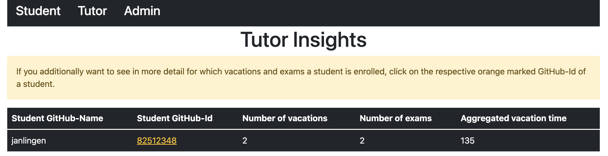

# Attendance-Manager

A spring boot application with a web user interface (thymeleaf) to manage project participant
absences in a university environment where students need to build daily attendance into their
flexible schedule, which may be filled with exams or other appointments away from home.

## Table of Contents

- [Installation and configuration](#installation-and-configuration)
- [Different stakeholder views](#different-stakeholder-views)
- [Stakeholder requirements](#stakeholder-requirements)
- [Architectural overview](#architectural-overview)
- [Quality goals](#quality-goals)
- [Vacation and Exam enrollment logic](#vacation-and-exam-enrollment-logic)

## Installation and configuration

1. Clone the repository and leave a star.
2. Make sure that you have `JDK 17.x` and `docker` installed!
3. Register a new OAuth application on
   GitHub ([tutorial here](https://docs.github.com/en/developers/apps/building-oauth-apps/creating-an-oauth-app))
   to generate a `CLIENT-ID` and `CLIENT-SECRET`
4. Set your "Personal Preferences" in the `application.properties` file which is located
   in `../src/main/resources/application.properties`
5. Start the preconfigured Docker container for the database.
    - `docker-compose up` while being in the directory
    - or `docker-compose up -d` if you want to continue using the terminal
6. Export the needed environment variables:
    - `export CLIENT_ID=YOUR_ClIENT_ID`
    - `export CLIENT_SECRET=YOUR_CLIENT_SECRET`
7. Start the application with `./gradlew bootRun` or `gradle bootRun` depending on your operating
   system.

## Different stakeholder views

### Student View

### Tutor View

### Admin View

## Stakeholder requirements

### Student

- Students use the application to enter planned absences. They can enter into the application when
  they want to write exams or when they want to take vacation. They get an overview of their
  remaining vacation time, their vacations and exams in general.

### Tutor

- Tutors are responsible for monitoring student attendance and contacting an administrator if a
  student is unlawfully absent. For this purpose, they can see when students are absent. The
  application is designed to provide tutors with a detailed overview of scheduled absences.

### Admin

- Admins get an overview of log messages which are generated when a student performs an action for
  himself in the system. They also have access to the functionalities of a tutor.

## Architectural Overview

### General (onion architecture)

- With the onion architecture, we have an infrastructure that denies access from inner layers to
  outer layers. This makes the domain model free of technical aspects and the domain-oriented code
  is better separated from the technical code. Within the layers high cohesion develops and between
  the layers small coupling develops.

### Domain context

- Entities
    - Student
        - Fields: id : Long, githubName : String, githubId : String, vacations : List\<Vacation>,
          examIds : List\<ExamId>, aggregatedVacationTime : Long
    - Exam
        - Fields: examId : Long, name : String, exemptionOffset : Integer, timeframe : Timeframe,
          online : Boolean
    - LogMessage
        - Fields: id : Long, githubId : String, action : String, createdAt : LocalDateTime
- Values
    - ExamId
        - Fields: id: Long
    - Timeframe
        - Fields: date : LocalDate, start : LocalTime, end : LocalTime
    - Vacation
        - Fields: timeframe : Timeframe, reason : String

### Technical context

- Spring Boot Framework: the framework of choice as it is perfect for monolith development
- GitHub OAuth2: the provider for authentication, since most computer science students
  already use it
- MariaDB: the database of choice, as it works smoothly between different processor architectures

## Quality Goals

| Goal                            | Description                                                                                                                                                                                                                                                                                  |
|---------------------------------|----------------------------------------------------------------------------------------------------------------------------------------------------------------------------------------------------------------------------------------------------------------------------------------------|
| Efficiency                      | Attendance Manager is designed to allow a student to comfortably obtain their leave of absence with as few clicks as possible.                                                                                                                                                               |
| Usability                       | Chicken is supposed to put a lot of emphasis on usability by enabling everyone to have access and feel integrated through optimised accessibility.                                                                                                                                           |
| Modifiability                   | By using interfaces, components can be exchanged without affecting the functionality of other components and due to the structure the coupling is low. This allows easy changes.                                                                                                             |
| Analyzability / Maintainability | All layers have defined tasks. It is ensured by different types of tests of the test pyramid that each component performs its task and in case of a change in the program which is accompanied by e.g. a logic change, the respective tests will fail and the error can be made out quickly. |

## Vacation and Exam enrollment logic

### Vacation Logic

- it is only possible to register for vacations that take place after the current day and time and
  do not fall on a weekend
- the start and the end must be divisible by the configured interval
- the start time must be before the end time and the day of the exam must be within the project
  period
- a vacation can only be registered if there is sufficient remaining vacation time, and if there is
  no exam on the same day, the vacation must comply with the maximum permissible duration
- if a new vacation conflicts with an already registered vacation, it is checked whether it is
  possible to merge the two vacations and whether they would then meet the already mentioned
  requirements

### Exam Logic

- it is only possible to register for exams that take place after the current day
- it is possible for a student to cancel the registration until 23:59 on the day before the exam
- if you book an exam which falls on the period of an already booked vacation, the vacation will be
  divided according to its length or cancelled completely in case of a complete overlap
- other basic rules for the creation of an exam are
    - the start time must be before the end time
    - the day of the exam must be within the project period
    - no exam can be created twice